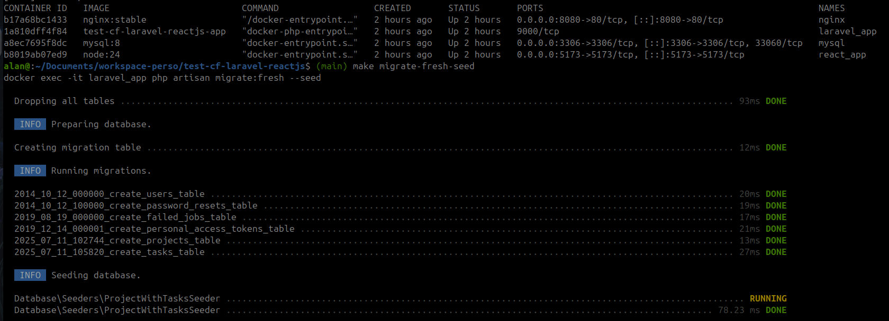

# Test Technique Laravel + reactJs ClubFunding - Alan H.

## Installation

Un fichier [Makefile](Makefile) permet d'installer facilement l'env grâce à docker et docker-compose

Les commandes à faire sont les suivantes :

```
make up
make install
make migrate

make migrate-fresh-seed
```

(La dernière commande permet d'injecter des seed en bdd grâce à Faker)

### TUs

Pour executer les TestUnitaire il y a 2 commandes, Back et Front


```
make test
make test-front
```


